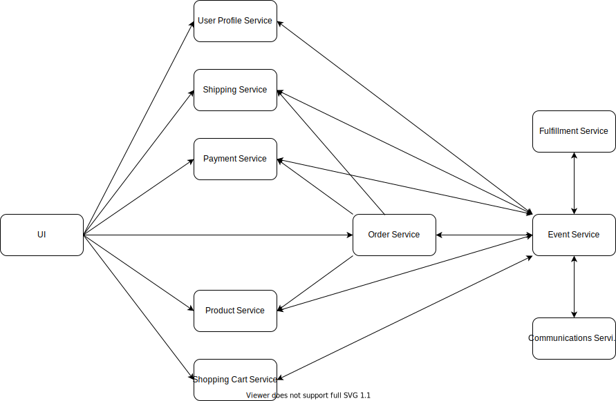

# User Interface

## Overview
Service for standardizing addresses.

## Goals
- Use a 3rd party service behind it
- Create a single API interface which doesn't change often, but allows us to change the 3rd party service easily.
- Translates data from their format to our needs.

## Non Goals
- Using more than one 3rd party service at the same time.

## Plan
Utilizes AWS API Gateway and Lambda Go based service which does the necessary data translation.

## Security, Privacy, Risks
User address data is passed through. 
